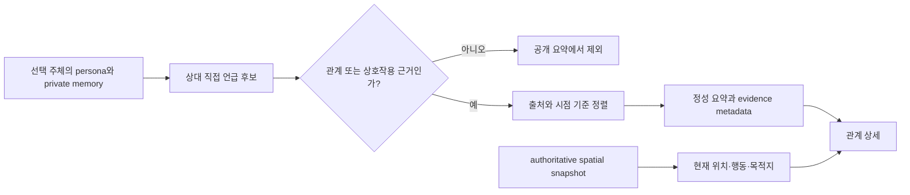

# 대시보드 관계 탭 개선 기획

> 상태: 구현 완료 · 2026-08-26 관계 수치 모델 승인 반영

## 1. 제품 질문

이 페이지가 답해야 하는 질문은 하나다.

> “선택한 에이전트는 이 사람을 어떤 근거로 어떻게 인식하고 있는가?”

상대가 지금 어디로 이동 중인지는 관계를 해석하는 보조 맥락이다. 따라서 관계
요약과 근거가 1차 정보이고, 실시간 행동·위치는 2차 정보여야 한다.

## 2. 제안 정보 구조

기존 2열 카드 그리드를 **대상 목록 + 관계 상세** 마스터–디테일 구조로 바꾼다.
대상마다 반복되던 상태·위치·근거 버튼을 한 상세 패널로 모아 정보 밀도를 낮추고,
긴 근거가 다른 카드 높이를 늘리지 않게 한다.

```text
┌ 하은이 바라보는 관계 ─────────────────────────────────────┐
│ 하은 자신의 성향과 기억에 기록된 근거만 보여줍니다.       │
├──────────── 대상 목록 ───────────┬──── 선택한 관계 ────────┤
│ ● 지호  정성 관계 기록 · 근거 2 │ 지호                    │
│   편안한 거리감으로 대화함       │ [정성 관계 기록]        │
│ ○ 정우  기록 없음               │                         │
│ ○ 민지  근거 1                  │ 관계 요약               │
│ ○ 수진  기록 없음               │ 하은은 저녁마다...       │
│ ○ 태오  기록 없음               │                         │
│                                  │ 관계를 뒷받침하는 기록   │
│                                  │  고정 성향 · 경험 기억   │
│                                  │                         │
│                                  │ 상대의 지금              │
│                                  │ 행동 / 현재 위치 / 목적지│
│                                  │ [지호의 관점에서 보기]   │
└──────────────────────────────────┴─────────────────────────┘
```

### 데스크톱

- 좌측 대상 목록은 280~320px 고정 폭, 우측 상세는 남은 폭을 사용한다.
- 최초 진입 시 근거가 있는 첫 번째 대상을 선택한다. 모두 비어 있으면 첫 번째
  대상을 선택하고 빈 상태를 보여준다.
- 대상 행 전체를 버튼으로 만들고 선택 상태를 텍스트·아이콘·배경으로 함께 표시한다.
- 근거는 상세 패널에서만 펼친다. 목록에는 한 줄 요약과 근거 수만 둔다.

### 모바일

- 720px 이하에서는 대상 목록을 상세 위에 세로 배치한다.
- 목록은 기본 3개까지 보이고 `다른 주민 더 보기`로 확장한다.
- 상세 선택 후 제목으로 포커스를 이동하지 않는다. 사용자가 실행한 관점 전환일
  때만 새 페이지 제목에 포커스를 안내한다.

### 개요 탭과의 경계

현재처럼 전체 `RelationshipPanel`을 개요와 관계 탭에 동시에 렌더링하지 않는다.
개요에는 `관계 기록이 있는 주민 N명`과 최근 변경 1건 정도의 축약 미리보기만 두고,
대상 비교·근거 탐색·관점 전환은 관계 탭에서 수행한다. 축약 미리보기를 이번 구현
범위에 넣지 않는다면 개요에서는 관계 블록을 제거하는 편이 중복보다 낫다.

## 3. 상세 패널 구성

### 3.1 헤더

- 대상 이름
- 상태 배지: `정성 관계 기록` 또는 `관계 기록 없음`
- 마지막 관계 근거 시각: `최근 기록 12:40`

헤더는 방향(`하은 → 지호`), 결정론적 상태 라벨, revision을 표시한다. 아래에는
친숙도·신뢰·인간적 호감·긴장·이성적 관심의 숫자와 meter를 함께 두고 색만으로
의미를 전달하지 않는다. 인간적 호감은 친구·이웃·동료로서 함께 있고 싶은 정도이고,
이성적 관심은 연애 관계를 바라는 정도다. 두 값은 독립적으로 변할 수 있다.
하트 아이콘은 “관계 탭” 탐색 아이콘으로만 사용한다.

### 3.2 관계 요약

요약은 1~2문장으로 제한하고 다음 규칙을 적용한다.

1. 선택한 주체의 `identity_stable_set`과 private memory만 후보로 사용한다.
2. 상대를 직접 언급하면서 관계·상호작용·평가를 표현한 문장만 채택한다.
3. PLAN은 관계 요약 후보에서 제외한다.
4. OBSERVATION은 대화, 도움, 갈등, 약속처럼 상호작용을 포함할 때만 채택한다.
5. REFLECTION은 citations가 현재 주체의 유효 기억을 가리킬 때 채택한다.
6. `planning_route`, `moving_to:`, `시간=`, `에이전트=`, `현재 계획=` 등 내부
   코드·진단 패턴은 차단한다.
7. 적합한 근거가 없으면 LLM이나 반대 관점으로 관계를 추측하지 않는다.

초기 구현은 결정론적 필터와 기존 문장 요약으로 충분하다. 별도 LLM 요약을 도입할
경우에도 schema validation, 한국어 정책, 길이 제한, 실패 시 빈 상태를 적용해야
하며 raw 결과를 직접 표시하지 않는다.

### 3.3 관계를 뒷받침하는 기록

근거를 다음 순서로 표시한다.

1. `고정 성향`: persona에서 상대와의 관계를 직접 명시한 문장
2. `성찰`: 유효 citations를 가진 관계 관련 reflection
3. `경험 기억`: 상호작용을 기록한 observation, 최신순

각 항목은 출처, 자연어 내용, 기록 시각을 보여준다. memory importance는 관계
강도로 오해될 수 있으므로 기본 화면에서는 숨기고 진단용 상세에서만
`기억 중요도`라고 명시한다. 근거 목록은 최대 5개를 먼저 보여주되 API가
`evidence_total`과 `has_more_evidence`를 제공해 잘림을 숨기지 않는다.

### 3.4 상대의 지금

관계 근거와 시각적으로 분리된 보조 섹션이다.

| 레이블    | 값                                                 | 예시                          |
| --------- | -------------------------------------------------- | ----------------------------- |
| 현재 행동 | `current_action`을 한국어 presentation으로 변환    | 이동 경로 계산 중             |
| 현재 위치 | 현재 tile을 authoritative map location에 투영한 값 | 브라이어 코브 > 중앙 광장     |
| 목적지    | `destination`                                      | 브라이어 코브 > 버드나무 시장 |

현재 위치를 제공할 수 없으면 목적지로 대체하지 않고 `확인할 수 없음`으로 표시한다.
내부 action code를 해석하지 못하면 원문 대신 `상태 확인 중`을 사용하고 진단 로그에
별도로 남긴다.

### 3.5 관점 전환

버튼 문구는 `지호의 관점에서 보기`로 한다. 실행하면 관계의 목적어만 바꾸는 것이
아니라 페이지 주체를 지호로 전환하고 모든 관계 데이터를 지호의 persona와 private
memory로 다시 구성한다. 브라우저 뒤로가기로 이전 관점에 돌아올 수 있도록 선택
주체와 대상은 URL query 또는 route 상태로 표현하는 방안을 구현 단계에서 검토한다.

## 4. 상태별 UX

| 상태               | 화면 처리                                                                              |
| ------------------ | -------------------------------------------------------------------------------------- |
| 로딩               | 목록과 상세의 형태를 유지하는 skeleton 표시                                            |
| 관계 근거 있음     | 정성 요약, 출처별 근거, 최근 기록 시각 표시                                            |
| 명시적 근거 없음   | `아직 기록된 관계가 없습니다.`와 `대화나 공동 경험이 기억되면 여기에 표시됩니다.` 표시 |
| 모든 후보가 필터됨 | 사용자에게는 근거 없음 상태를 표시하고 운영 진단에는 필터 사유·개수만 기록             |
| 상대 runtime 없음  | 관계 정보는 유지하고 `상대의 지금`만 `현재 상태를 확인할 수 없습니다.`로 표시          |
| API 오류           | 마지막 정상 데이터를 관계 사실로 위장하지 않고 재시도 가능한 오류 상태 표시            |

## 5. 문구 사전

| 기존 문구                 | 개선 문구                               |
| ------------------------- | --------------------------------------- |
| 다른 에이전트에 대한 인식 | 하은이 바라보는 관계                    |
| 호감도 · 정성 상태        | 정성 관계 기록                          |
| 관계 근거 보기            | 관계를 뒷받침하는 기록                  |
| 관계 근거 5개             | 근거 5개 이상 / 총 12개 · 최근 5개 표시 |
| 상대 현재 상태            | 현재 행동                               |
| 현재 위치 (`destination`) | 목적지                                  |
| TO · jiho                 | 삭제, 대상 이름 `지호`만 표시           |
| PERSONA                   | 고정 성향                               |
| MEMORY #12                | 경험 기억                               |
| 지호 관점 보기            | 지호의 관점에서 보기                    |

## 6. 제안 데이터 계약

`DashboardRelationship`은 방향성과 정성 근거를 유지하면서 수치 상태와 최근 event를
동시에 전달한다.

```ts
interface DashboardRelationship {
  target_agent_id: AgentId;
  target_name: string;
  measurement: "modeled_v1";
  metrics: {
    familiarity: number;
    trust: number;
    affinity: number;
    tension: number;
    romantic_interest: number;
  };
  revision: number;
  updated_at: string | null;
  last_interaction_at: string | null;
  summary: string | null;
  summary_status: "available" | "no_explicit_evidence";
  evidence_total: number;
  has_more_evidence: boolean;
  recent_events: DashboardRelationshipEvent[];
  evidence: DashboardRelationshipEvidence[];
}

interface DashboardAgent {
  current_location_path: string | null;
  destination: string | null;
}
```

- `summary`는 필터를 통과한 관계 문장만 허용한다.
- 필터 상세 사유나 원문은 public contract에 추가하지 않는다.
- `current_location_path`는 backend world map이 authoritative tile에서 계산한다.
- `importance`와 retrieval score는 관계 점수로 렌더링하지 않는다.
- 새 필드를 도입하면 Pydantic schema, shared type, runtime parser, fixtures와
  회귀 테스트를 함께 갱신한다.
- 관계 근거 후보 조회는 일반 기억 탭의 `memory_limit`과 분리한다. 관계 전용 조회
  한도와 정렬 정책을 사용해 오래된 핵심 관계 기억이 잘리지 않게 한다.

### 소유 계층

- 관계 후보 선별, 안전 필터, 요약 상태, 전체 근거 수는 dashboard
  diagnostics/read-model 계층이 소유한다.
- Brain의 `ActionLoopResult`에 대시보드 전용 필드를 추가하지 않는다.
- `/ws/world`는 기존 spatial snapshot 계약을 유지한다. 새 관계 메타데이터는
  읽기 전용 `GET /dashboard/state`에서만 제공한다.
- 프런트엔드는 backend가 승인한 공개용 문장을 렌더링하되, 알 수 없는 enum이나
  내부 코드가 들어오면 안전한 빈 상태로 처리한다.

## 7. 데이터 흐름



이 흐름은 관계 판단과 운영 진단을 분리한다. 필터에서 제외한 원문을 Brain 결과나
공개 relationship payload에 되돌려 넣지 않는다.

## 8. 구현 순서

1. 관계 후보 분류 규칙과 오염 문자열 회귀 fixture를 backend 테스트로 고정한다.
2. 일반 기억 `memory_limit`과 독립된 관계 근거 조회 범위·정렬 정책을 정의한다.
3. `RelationshipSnapshot`에 요약 상태와 전체 근거 수를 추가한다.
4. authoritative tile 기준 `current_location_path`를 dashboard agent 계약에 추가한다.
5. Pydantic, shared type, frontend runtime parser를 함께 갱신한다.
6. 관계 탭을 마스터–디테일 구조로 변경하고 한국어 문구·빈 상태를 적용한다.
7. 개요 탭의 전체 관계 패널 중복을 제거한다.
8. 단위 테스트, frontend interaction test, 반응형 브라우저 검증을 수행한다.
9. 실제 `/dashboard/state`와 공개 `/dashboard`에서 내부 문자열이 사라졌는지 확인한다.
10. 의미 계약 변경을 `SPEC.md`와 `TODO.md`에 반영한다.

## 9. 검증 계획

- Backend: 이름만 포함된 PLAN, `planning_route` 관찰, `키=값` 진단형 기억이 관계
  요약·근거에서 제외되는지 테스트한다.
- 범위: 일반 기억 `memory_limit`보다 오래된 핵심 관계 기억도 관계 탭에서는
  유지되는지 테스트한다.
- 방향성: 지호→수진과 수진→지호의 기존 비대칭 테스트를 유지한다.
- 계약: Pydantic 응답, shared type, `parseDashboardState`의 새 필드를 함께 검증한다.
- Frontend: 대상 선택, 빈 상태, 근거 더 보기, 관점 전환, 키보드 포커스를 테스트한다.
- 반응형: 390px, 720px, 넓은 데스크톱에서 가로 overflow와 큰 빈 공간이 없는지
  확인한다.
- Live: 실제 runtime의 `/dashboard/state`와 `/dashboard`를 확인해 현재 위치와
  목적지가 다르게 표시되고 raw diagnostic/action code가 노출되지 않음을 증명한다.

## 10. 결정이 필요한 항목

구현 전에 아래 두 항목만 확정하면 된다.

1. 관계 상세의 URL 상태를 query(`?subject=haeun&target=jiho`)로 둘지 기존 선택
   store에만 둘지.
2. 1차 구현에서 기존 관계 문장을 그대로 사용하고 필터만 강화할지, 근거 여러 개를
   합치는 별도 schema-constrained 요약 단계를 도입할지.

권장안은 query로 관점을 보존하고, 1차 구현은 결정론적 필터로 시작하는 것이다.
이 방식이 링크 공유·뒤로가기·테스트를 쉽게 하며 불필요한 LLM 실패 경로를 늘리지
않는다.

## 11. 위험과 후속 확장

- 현재 이름 substring 매칭은 동명이인, 부분 문자열, 단순 계획문을 오탐할 수 있다.
  1차 구현은 node type과 문장 패턴을 함께 검증하고, 장기적으로 memory에
  `related_agent_ids` 같은 명시적 엔티티 연결을 추가할지 `[확인 필요]`로 남긴다.
- PLAN을 전부 버리면 관계가 계획에만 남은 사례를 놓칠 수 있다. 요약 후보에서는
  제외하되, 상대와의 약속·공동 행동이 명시된 계획을 근거로 허용할지는 fixture로
  정책을 먼저 확정한다.
- `/dashboard/state`는 주기적으로 조회되므로 read 요청마다 LLM 요약을 실행하면
  지연·비용·비결정성이 커진다. 1차는 결정론적 파생을 사용하고, LLM이 필요해지면
  persona/memory revision 기반 캐시로 요청 경로와 분리한다.
- 공개 대시보드가 private memory 원문을 어디까지 보여줄지는 인증·운영 정책과 함께
  별도 검토가 필요하다. 최소 기준은 진단 원문과 prompt형 문자열의 공개 금지다.
