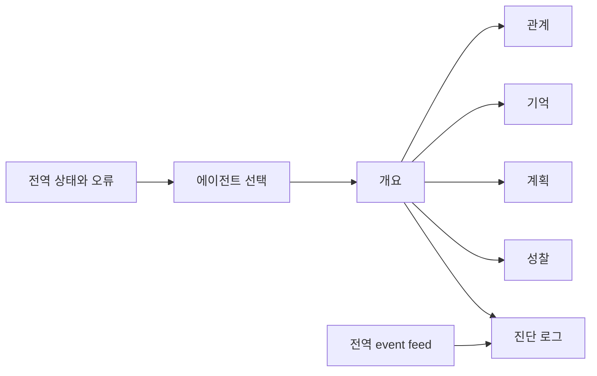
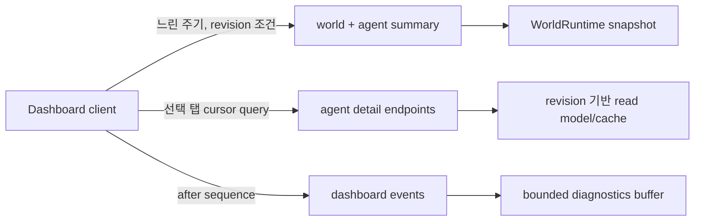

# 대시보드 탭 제품 기획

> 구현 상태: 2026-08-26 승인된 P0/P1 개선 완료. 로그인 제한 없이 기억·성찰·관계
> 근거 원문을 공개하며 상세 변경과 검증은 `03_changelog.md`, `04_verification.md`를 따른다.

> 상태: 현재 구현 분석과 개선 방향 확정, 구현 전

## 1. 제품 정의

`/dashboard`는 게임을 보는 화면이 아니라 실제 에이전트 runtime을 설명하고 장애를 추적하는 **인지 관측 도구**다. 정보 구조는 다음 세 단계로 정리한다.

### 개요 프로필 read model

- `DashboardAgent`는 `age`, `gender`, `traits`, `persona`를 제공한다.
- `age`, `traits`, `persona`는 현재 runtime identity/profile에서 읽고,
  `gender`도 persona loader가 runtime identity에 명시적으로 적재한다. 이름으로
  성별을 추측하거나 frontend에 주민별 상수를 중복 정의하지 않는다.
- 개요 상단 전폭 카드에서 나이·성별을 빠르게 확인하고 traits는 태그로, 실제
  `identity_stable_set` 전체는 읽기 쉬운 문장 목록으로 표시한다.
- provider prompt, model thought, governance trace는 persona 표시 범위에 포함하지
  않는다.

### 주민 초상화

- 6명의 고정 persona를 바탕으로 동일한 픽셀 밀도, 정사각형 구도, 제한 색상과
  투명 배경을 사용하는 원본 초상화를 프로젝트 정적 asset으로 관리한다.
- `agent_id`를 `/portraits/<agent_id>.png`에 대응시키며 dashboard API와 저장
  snapshot에는 이미지 binary나 URL을 추가하지 않는다.
- 목록은 작은 정사각형 crop, 개요는 얼굴 전체가 보이는 큰 `contain` 렌더링을
  사용한다. 미등록 주민은 깨진 이미지 대신 이름 첫 글자를 표시한다.
- 후속 주민은 `.agents/skills/agent-crossing-portraits/`의 project skill을
  사용한다. 이 skill은 persona 기반 prompt, 기존 asset의 style-reference 사용,
  512×512 RGBA 정규화와 alpha 검증을 같은 계약으로 반복한다.

1. **전역 상태**: 세계 시각, scheduler/cognition, 오류, 신선도
2. **선택 agent 상태**: 개요와 5개 상세 탭
3. **전역 event feed**: 우측 rail의 짧은 최신 사건

상세 정보는 필요한 순간에만 펼친다. 우측 rail과 진단 로그 탭처럼 같은 상세 컴포넌트를 이중 노출하지 않는다.

## 2. 공통 shell 기획

### 상단 상태 바

- 세계 시각, turn, spatial revision, latest event sequence
- 연결 상태: 연결 중 / 정상 / 갱신 지연 / 오프라인
- runtime 상태: scheduler, cognition, planning error, cognitive runtime error
- 마지막 정상 수신 시각과 수동 새로고침

`planning_error`를 네트워크 `OFFLINE`과 같은 상태로 합치지 않는다. 네트워크, runtime, planning은 원인과 대응이 다르다.

### 에이전트 rail

- 선택 상태를 `aria-current` 또는 `aria-pressed`로 전달한다.
- 행동 요약과 오류 badge를 표시한다.
- 모바일에서는 runtime card를 제거하지 않고 접이식 요약으로 옮긴다.

### 탭 탐색

- URL 예시: `/dashboard?agent=haeun&tab=plans`
- 관계 관점 예시: `&target=jiho`
- 표준 tab semantics와 좌우 방향키를 제공한다.
- 탭 전환 시 heading으로 focus를 이동하되 실시간 갱신에는 focus를 빼앗지 않는다.

## 3. 탭별 기획

### 3.1 개요 — "지금 무슨 일이 일어나는가"

**핵심 사용자 질문**

- 지금 어디에서 무엇을 하는가?
- 실행 중인 가장 구체적인 계획은 무엇인가?
- 최근 사용자 관찰 신호와 내부 상태가 일치하는가?
- 곧 살펴봐야 할 오류나 성찰 임계치가 있는가?

**정보 우선순위**

1. 오류·불일치: runtime/planning error, 위치 미확인, stale
2. 현재 행동·실제 위치·목적지·경로
3. 활성 minute plan과 상위 hour/day 맥락
4. 현재 표시 중인 speech/thought/action
5. 성찰 누적과 다음 임계치

현재 구현의 "최근 생각"은 최신 diagnostics가 아니라 `bubble_kind=thought`일 때의 현재 bubble이다(`Dashboard.tsx:434-476`). 문구를 "현재 표시 중인 생각"으로 정확히 바꾸거나 최신 diagnostics event를 별도 연결한다. `current_plan_context`는 profile 문맥이므로 active plan의 fallback처럼 보이지 않게 "배경 계획 문맥"으로 분리한다.

**개선안**

- 알 수 없는 action을 모두 "상태 확인 중"으로 숨기지 말고 안전한 한국어 fallback과 원본 code를 운영자용으로 병기한다.
- 위치가 null인데 action/destination이 장소를 가리키면 "현재 위치 판정 불가" 경고를 낸다.
- 성찰 막대는 `<progress>`와 남은 중요도를 사용한다.
- 카드마다 데이터 기준 revision/시각을 표시하지 않고 상단 공통 freshness로 묶어 소음을 줄인다.

### 3.2 관계 — "이 agent는 상대를 어떻게 보는가"

관계 탭은 기존 상세 기획과 구현이 가장 성숙하다. 대상 목록, `A → B` 상세, 5축 meter, 최근 delta, 정성 근거, 반대 관점 전환을 유지한다.

**추가 개선안**

- 마지막 상호작용/갱신 시각과 revision을 사람이 읽기 쉬운 형태로 표시한다.
- 지표별 범위(0~100 또는 -100~100), 의미, 증가 조건을 도움말로 제공한다.
- 근거 `total`, 표시 건수, cursor 기반 더 보기를 제공한다.
- 현재 자동 연결 범위가 완료된 실제 대화 중심이라면 설명도 그 범위를 넘지 않는다.
- 모바일 대상 목록은 접기/더 보기로 초기 길이를 제한한다.
- 장기적으로 이름 substring 대신 `related_agent_ids` 같은 구조화된 근거를 사용한다.

상대의 현재 위치·행동은 관계 판단 근거와 시각적으로 계속 분리한다. memory importance를 관계 점수로 변환하지 않는다.

### 3.3 기억 — "무엇을 기억하고 무엇을 다시 떠올렸는가"

**기본 화면**

- 상단: 전체 건수, 현재 필터, 정렬, 검색
- 필터: 관찰/계획/성찰, 생성 기간, 중요도
- 정렬: 최신 생성, 최근 접근, 중요도
- 행: 유형, 생성 시각, 최근 접근, 중요도, 내용, citation
- citation 선택 시 같은 탭 안에서 원 기억을 강조하거나 side panel로 연다.

현재 UI의 숫자는 최대 100개인 응답 배열 길이일 뿐 전체 기억 수가 아니다. `total`, `next_cursor`, `has_more` 계약을 추가한다. 무한 스크롤보다 cursor pagination과 명시적 "더 보기"를 우선한다. 운영 감사에서 현재 범위를 알기 쉽고 live update에 덜 흔들리기 때문이다.

**빈/오류 상태**

- 기억 0개
- 필터 결과 0개
- 더 오래된 기억이 있으나 현재 페이지에 없음
- 원문 응답 누락 또는 형식 오류

### 3.4 계획 — "무엇을 하기로 했고 현재 어디까지 왔는가"

현재의 day/hour/minute 카드와 day plan 나열을 **시간축 + 계층 inspector**로 재구성한다.

- 상단: active day/hour/minute breadcrumb
- 중앙: 하루 timeline, 현재 시각 marker, 완료/진행/예정 상태
- 상세: 선택 계획의 행동, 장소, 기간, 상위/하위 관계
- 진단: revision, installed/generated time, last replan reason
- 검증 badge: gap, overlap, invalid location, duration/bounds 실패

전역 `planning_error`는 agent와 실패 계층을 알 수 없다. governance/diagnostics가 소유하는 구조화된 `agent_id`, `stage`, `window`, `occurred_at`, `retryable` metadata를 계획 탭에서 연결한다. Brain 결과 계약은 확장하지 않는다.

day plan이 비면 "없음", "생성 중", "생성 실패", "아직 시간창 전"을 구분한다. `DAY/HOUR/MINUTE`, `Plan hierarchy`는 각각 `일일/시간/분 단위 계획`, `계획 계층`으로 표기한다.

### 3.5 성찰 — "성찰이 언제 왜 만들어졌는가"

**상단 상태**

- 누적 중요도 / 임계치 / 남은 중요도
- 마지막 성찰 시각
- 상태: 임계치 전 / 생성 중 / 실패 / 완료

**성찰 목록**

- reflection 전용 total/cursor로 조회한다.
- 성찰 본문과 생성 시각, importance, citation 수를 보여준다.
- citation을 펼치면 어떤 기억 묶음에서 insight가 나왔는지 탐색한다.

현재는 최근 memory 최대 100개에서 `REFLECTION`만 client filtering하므로 오래된 성찰이 보이지 않을 수 있다. 성찰 전용 read model이 필요하다. 0건일 때 빈 패널 대신 "아직 임계치에 도달하지 않음"과 남은 값을 설명한다.

### 3.6 진단 로그 — "어떤 판단이 왜 성공하거나 실패했는가"

**역할 분리**

- 우측 rail: 전 agent의 sequence, agent, 결과, 실패 여부만 표시
- 진단 로그 탭: 선택 agent의 상세 event와 governance trace 표시

현재 `filteredEvents`는 우측 filter를 먼저 적용하고 중앙 탭에서 선택 agent를 다시 거른다(`Dashboard.tsx:538-547, 770-777`). 우측 filter가 다른 agent면 중앙이 비는 결함이므로 두 selector를 독립시킨다.

**상세 기능**

- turn/시간 범위, 성공/파싱 실패, 발화/침묵, 텍스트 필터
- sequence 기준 신규 event 따라가기, 일시정지, 재개
- buffer의 oldest/latest sequence와 gap 안내
- 구조화 trace 접기/펼치기, 허용된 JSON 복사
- event 고유 링크: `/dashboard?agent=haeun&tab=logs&sequence=64`

**보안 경계**

memory·reflection·관계 근거는 실제 제품 상태이므로 원문을 공개한다. 반면 provider `raw_response`, prompt, API key, embedding과 `model_thought`, self critique, full decision/governance trace는 제품 데이터 계약에 넣지 않는다. 공개 여부는 로그인 유무가 아니라 명시적인 DTO allowlist로 결정한다.

## 4. 데이터 흐름 개선

현재 `/dashboard/state`는 모든 agent의 memory·관계·event를 한 번에 조립하고 client가 매초 전체를 다시 받는다. 관계 요약은 agent×target마다 전체 private memory를 스캔한다. 공개 표본은 약 280KB였다.

**권장 계약 방향**

- summary: world와 agent별 현재 상태만, ETag/revision 지원
- detail: 선택 agent와 활성 탭 데이터만 cursor 조회
- events: 기존 `/dashboard/events?after=`를 실제 사용
- polling: 요청 완료 뒤 다음 요청 예약, in-flight skip, hidden tab 감속, 오류 backoff
- consistency: 응답에 `snapshot_revision`, `generated_at`, event sequence 범위를 명시
- 관계: `(session, subject, target, relationship revision, memory revision)` 기반 cache/read model

정확한 endpoint 분리는 구현 설계 단계에서 확정하되, 기존 `/dashboard/state`를 한 번에 제거하지 않고 frontend 전환 기간을 둔다.

## 5. 접근성과 반응형

- tablist/tab/tabpanel과 방향키 패턴
- 선택 agent와 relationship target의 programmatic selected 상태
- alert/status/live region을 구분하고 실시간 갱신은 지나치게 읽지 않게 한다.
- progress/meter에 값, 범위, 의미를 제공한다.
- 관계 탭에만 적용된 focus-visible·12~14px typography·44px touch target을 전체 dashboard로 확장한다.
- 모바일에서도 scheduler/cognitive/freshness를 접이식 상태 카드로 유지한다.
- 긴 JSON과 기억 본문은 container 내부 wrap/scroll을 사용한다.

## 6. 측정 기준

- 첫 정상 상태 파악까지 걸린 시간
- stale/offline 오판 없이 복구한 비율
- dashboard summary 응답 크기와 p95 응답 시간
- 열려 있는 client 1개당 분당 전송량
- memory/relationship/detail query p95
- keyboard-only 주요 과업 성공률
- 계획/인지 오류에서 원인 event까지 이동한 시간

초기 목표값은 구현 전 현재 runtime에서 baseline을 측정한 후 확정한다. 임의 목표를 문서에 고정하지 않는다.

## 7. 테스트 전략

| 범위          | 핵심 검증                                                                          |
| ------------- | ---------------------------------------------------------------------------------- |
| Contract      | total/cursor, sequence gap, structured error, redaction allowlist, revision 일관성 |
| Component     | 6개 탭 전환, empty/error/stale, 우측/중앙 filter 독립성, citation 이동             |
| Accessibility | tab keyboard, focus order, status/alert/progress name·value                        |
| Responsive    | 390/720/1120px, 긴 기억·JSON, runtime 정보 보존                                    |
| Integration   | 느린 응답에서 polling starvation 없음, cursor resume, URL 복원                     |
| Live          | 공개/API 권한, 위치 정확성, payload 크기, console/network error                    |
